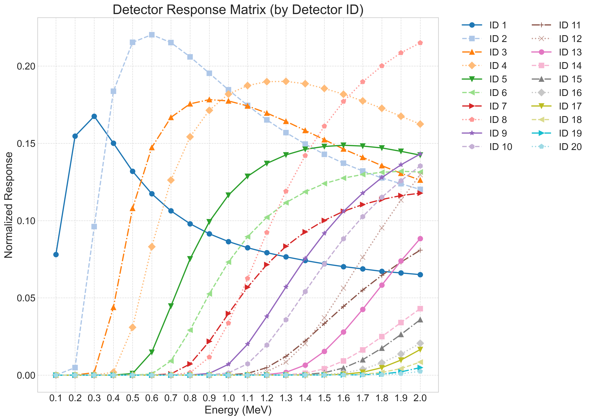
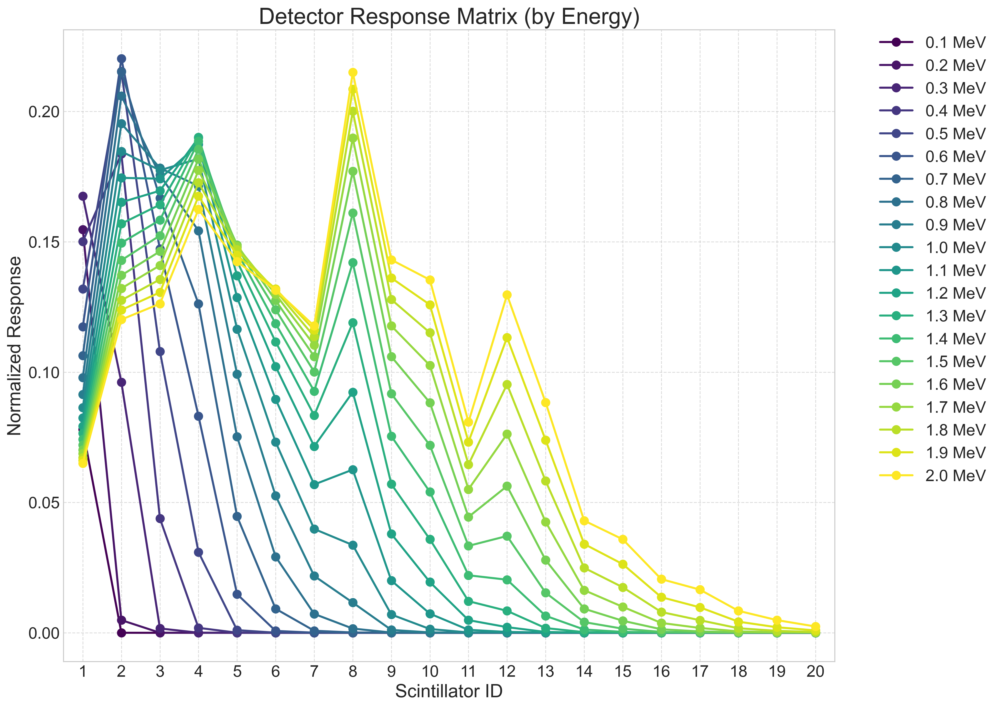

# 探测器响应矩阵图表说明

## 数据来源与图表生成方法

这两幅图表展示了探测器对不同能量粒子的响应情况，数据来源于处理后的实验结果。通过以下步骤生成：

1. 收集不同入射能量(0.1-2.0MeV)下的粒子与探测器相互作用数据
2. 对每个能量文件夹下的数据进行合并处理
3. 计算归一化响应（沉积能量/入射粒子数）
4. 将结果整合为响应矩阵(RM.txt)
5. 使用matplotlib绘制不同视角的可视化图表

## 图表解读

### 图一：按探测器ID分组 (response_matrix_by_detector_plot.png)

- **横轴**：入射粒子能量(0.1-2.0MeV)
- **纵轴**：归一化响应值
- **曲线**：每条曲线代表一个探测器ID(1-20)的响应特性
- **含义**：展示了每个探测器对不同能量粒子的敏感度变化

从图中可以观察到：
- 前几层探测器(ID 1-5)对低能粒子有较强响应，随能量增加响应逐渐降低
- 中间层探测器(ID 6-10)对中等能量粒子响应最强
- 后层探测器(ID 11-20)主要对高能粒子有响应
- 探测器的峰值响应随ID增加而向高能区域移动

### 图二：按能量分组 (response_matrix_by_energy_plot.png)

- **横轴**：探测器ID(1-20)
- **纵轴**：归一化响应值
- **曲线**：每条曲线代表一个特定能量的粒子
- **含义**：展示了不同能量粒子在探测器阵列中的能量沉积分布

从图中可以观察到：
- 低能粒子(0.1-0.5MeV)主要在前几层探测器中沉积能量
- 随着能量增加，能量沉积区域向后层探测器移动
- 高能粒子(1.5-2.0MeV)能够穿透更多层探测器，在更深处沉积能量
- 能量沉积峰值随入射能量增加而向后移动

## 两图的对应关系

这两幅图表本质上展示了同一个响应矩阵的两种不同视角：

- **图一**是矩阵按行切割，展示每个探测器(行)对所有能量的响应
- **图二**是矩阵按列切割，展示每个能量(列)在所有探测器中的分布

它们是同一数据的转置关系，完全互补，共同构成了探测器系统响应特性的完整描述。

## 响应矩阵的意义与应用

响应矩阵是粒子探测系统的核心表征参数，具有以下重要应用：

1. **能谱反演**：通过响应矩阵可以从测量结果反推原始粒子能谱
2. **探测器性能评估**：评估探测器对不同能量粒子的灵敏度和分辨率
3. **系统设计优化**：指导多层探测器阵列的结构设计和优化
4. **粒子识别**：辅助区分不同类型粒子产生的信号
5. **模拟验证**：验证Monte Carlo模拟结果与实验数据的一致性

这些图表直观展示了探测器阵列对不同能量粒子的响应特性，有助于理解粒子在多层闪烁体中的能量沉积规律，为探测系统的校准和数据分析提供重要参考。

## 结论

通过这两幅互补的响应矩阵图表，我们可以全面了解探测器系统的性能特点。对于粒子物理实验数据分析、探测器系统设计和射线防护研究等领域都具有重要参考价值。
